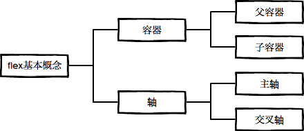
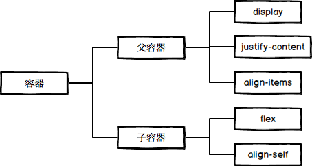
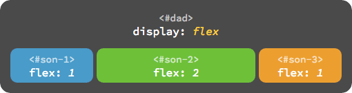

## 一劳永逸的解决 flex 布局的问题

### 寻根溯源话布局

一切都始于这样一个问题，怎样通过 css 简单优雅的实现水平、垂直同时居中？记得刚开始学 css 时看到 float 属性不觉眼前一亮，自然而然的联想到 word 中文字排版的左对齐，右对齐和居中，然后失望的发现并不存在 `float: center` 的写法。那么 `text-align: center`、`verticle-align: center` 是否可以呢？答案是否定的。这两个属性只能用于行内元素，对于块级元素是无效的。

在网页布局没有进入 css 的时代，排版几乎是通过 table 元素实现的，在 table 的单元格里可以方便的使用 `align`、`valign` 来实现水平和垂直方向的对齐，随着 web 语义化的流行，这些写法逐渐淡出了视野，css 标准为我们提供了 3 种布局方式：标准文档流、浮动布局和定位布局。这几种方式的搭配使用可以满足 pc 客户端定宽页面的需求，比如实现水平居中可以使用 `margin: 0 auto`，实现水平垂直同时居中可以如下设置：

```css
.dad {
    ...
    position: relative;
}

.son {
    ...
    position: absolute;
    top: 0;
    right: 0;
    bottom: 0;
    left: 0;
}
```

```css
.dad {
    ...
    position: relative;
}

.son {
    width: 100px;
    height: 100px;
    position: absolute;
    top: 50%;
    left: 50%;
    margin-top: -50px;
    margin-left: -50px;
}
```

但是这些写法都有一些缺陷：缺少语义并且不够灵活。我们需要的是通过 1 个属性就能优雅的实现子元素居中或均匀分布，甚至可以随着窗口缩放自动适应。在这样的需求下，css 的第 4 种布局方式诞生了，这就是我们今天要重点介绍的 flex 布局。

### flex 基本概念

说到底 flex 都有哪些特性呢？其实很简单，核心的概念只有两个：容器和轴。容器包括外层的父容器和内层的子容器，轴包括主轴和交叉轴，可以说 flex 布局的全部基础都构建在这两个概念上。



1. 容器

容器具有这样的特点：父容器可以统一设置子容器的排列方式，子容器也可以单独设置自身的排列方式，如果两者若同时设置，以子容器的设置为准。

flex 布局涉及到 12 个 CSS 属性（不含 `display`），其中父容器、子容器各 6 个。不过常用的属性只有 4 个，父容器、子容器各 2 个。



使用 flex 布局首先要设置父容器 `display: flex`，其次设置子容器的 `flex` 属性。

``` css
#dad {
    display: flex
}

#son-1 {
    flex: 1
}

#son-2 {
    flex: 2
}

#son-3 {
    flex: 1
}
```



- 父容器


