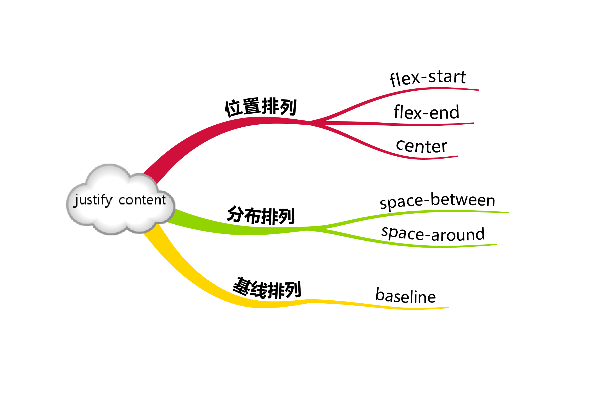

## 一劳永逸的搞定 flex 布局

## 寻根溯源话布局

一切都始于这样一个问题，怎样通过 CSS 简单优雅的实现水平、垂直同时居中？记得刚开始学 CSS 时看到 `float` 属性不觉眼前一亮，自然而然的联想到 Word 中文字排版的左对齐、右对齐和居中，然后失望的发现并不存在 `float: center` 的写法。那么 `text-align: center`、`verticle-align: center` 是否可以呢？答案是否定的。这两个属性只能用于行内元素，对于块级元素是无效的。

在网页布局没有进入 CSS 的时代，排版几乎是通过 `table` 元素实现的，在 `table` 的单元格里可以方便的使用 `align`、`valign` 来实现水平和垂直方向的对齐，随着 Web 语义化的流行，这些写法逐渐淡出了视野，CSS 标准为我们提供了 3 种布局方式：`标准文档流`、`浮动布局`和`定位布局`。这几种方式的搭配使用可以满足 PC 客户端定宽页面的需求，比如实现水平居中可以使用 `margin: 0 auto`，实现水平垂直同时居中可以如下设置：

```css
.dad {
    ...
    position: relative;
}

.son {
    ...
    position: absolute;
    top: 0;
    right: 0;
    bottom: 0;
    left: 0;
}
```

```css
.dad {
    ...
    position: relative;
}

.son {
    width: 100px;
    height: 100px;
    position: absolute;
    top: 50%;
    left: 50%;
    margin-top: -50px;
    margin-left: -50px;
}
```

但是这些写法都有一些缺陷：缺少语义并且不够灵活。我们需要的是通过 1 个属性就能优雅的实现子元素居中或均匀分布，甚至可以随着窗口缩放自动适应。在这样的需求下，CSS 的第 4 种布局方式诞生了，这就是我们今天要重点介绍的 flex 布局。

## flex 基本概念

说到底 flex 都有哪些特性呢？其实很简单，核心的概念只有两个：容器和轴。容器包括外层的父容器和内层的子容器，轴包括主轴和交叉轴，可以说 flex 布局的全部基础都构建在这两个概念上。


1. 容器

容器具有这样的特点：父容器可以统一设置子容器的排列方式，子容器也可以单独设置自身的排列方式，如果两者同时设置，以子容器的设置为准。

flex 布局涉及到 12 个 CSS 属性（不含 `display`），其中父容器、子容器各 6 个。不过常用的属性只有 4 个，父容器、子容器各 2 个。


使用 flex 布局首先要设置父容器 `display: flex`，其次设置子容器的 `flex` 属性。

``` css
#dad {
    display: flex
}

#son-1 {
    flex: 1
}

#son-2 {
    flex: 2
}

#son-3 {
    flex: 1
}
```


- 父容器

  - 设置子容器沿主轴排列：justify-content

  justify-content 属性用于定义如何沿着主轴方向分配子容器的间距。

  

    - flex-start：起始端对齐

    

    - flex-end：末尾段对齐

    

    - center：居中对齐

    

    - space-around：子容器沿主轴均匀分布，位于首尾两端的子容器到父容器的距离是子容器间距的一半。

    

    - space-between：子容器沿主轴均匀分布，位于首尾两端的子容器与父容器相切。

    

  - 设置子容器沿交叉轴排列：align-items

  align-items 属性用于定义如何沿着交叉轴方向分配子容器的间距。

  

    - flex-start：起始端对齐

    

    - flex-end：末尾段对齐

    

    - center：居中对齐

    

    - baseline：这里的 baseline 默认是对首行文字而言的，即 first baseline，所有子容器的基线位于同一条直线上，基线距离侧轴始端最远的子容器与侧轴始端相切。

    

    - stretch：子容器沿侧轴方向的尺寸拉伸至与父容器一致。

    

- 子容器

  - 在主轴上如何伸缩：flex

  - 与众不同的交叉轴排列：align-self

- 轴

  

  - 主轴

  > 向右：`flex-direction: row`

  

  > 向下：`flex-direction: column`

  

  > 向左：`flex-direction: row-reverse`

  

  > 向上：`flex-direction: column-reverse`

  
  

  - 交叉轴

  主轴逆时针旋转 90° 就是交叉轴。

  通过以上这些常用属性实现常用的 flex 应该没有问题，如果要实现复杂的布局还需要深入了解更多的属性。

  ### flex 进阶概念

- 父容器

  - 设置换行方式：flex-wrap

  - 轴向与换行一起搞定：flex-flow

  - 多行沿交叉轴对齐：align-content

- 子容器

  - 设置基准大小：flex-basis

  - 设置扩展比例：flex-grow

  - 设置收缩比例：flex-shink

  - 设置排列顺序：order

  以上就是 flex 布局涉及到的全部属性，是不是已经跃跃欲试了?


