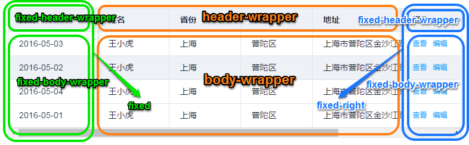
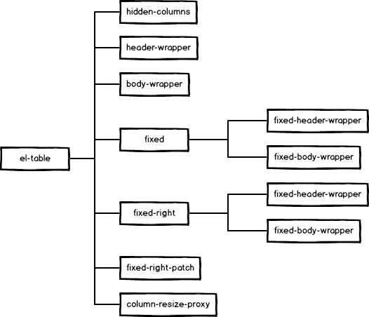
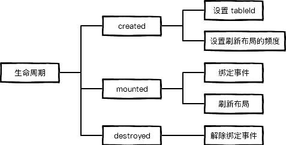

## 表格结构



``` html
<div class="el-table">
    <!--隐藏列-->
    <div class="hidden-columns"></div>
    <!--表头部分-->
    <div class="el-table__header-wrapper"></div>
    <!--表格主体-->
    <div class="el-table__body-wrapper"></div>
    <!--左侧固定列-->
    <div class="el-table__fixed"></div>
    <!--右侧固定列-->
    <div class="el-table__fixed-right"></div>
    <!--右侧固定列补丁-->
    <div class="el-table__fixed-right-patch"></div>
    <!--列宽调整代理-->
    <div class="el-table__column-resize-proxy"></div>
</div>
```



### 隐藏列

### 表头部分

``` js
// TableHeader作为独立的子组件引入
import TableHeader from './table-header'
```
``` html
<div class="el-table__header-wrapper">
    <table-header></table-header>
</div>
```

### 表格主体

``` js
// TableBody作为独立的子组件引入
import TableBody from './table-body'
```
``` html
<div class="el-table__body-wrapper">
    <table-body></table-body>
    <!--表格数据为空时，显示占位符-->
    <div class="el-table__empty-block"></div>
</div>
```

### 左侧固定列

``` html
<div class="el-table__fixed">
    <div class="el-table__fixed-header-wrapper"></div>
    <div class="el-table__fixed-body-wrapper"></div>
</div>
```

### 右侧固定列

右侧固定列的结构与左侧相同

``` html
<div class="el-table__fixed-right">
    <div class="el-table__fixed-header-wrapper"></div>
    <div class="el-table__fixed-body-wrapper"></div>
</div>
```

### 右侧固定列补丁

预留滚动条的宽度

### 列宽调整代理

显示调整表格尺寸的按钮

## 子组件

### import 项

``` js
// 用于选择列的多选按钮
import ElCheckbox from 'element-ui/packages/checkbox'
// 控制操作频度的组件
import throttle from 'throttle-debounce/throttle'
import debounce from 'throttle-debounce/debounce'
// 添加或移除调整尺寸事件
import { addResizeListener, removeResizeListener } from 'element-ui/src/utils/resize-event'
// 多语言支持
import Locale from 'element-ui/src/mixins/locale'
// 表格状态管理组件
import TableStore from './table-store'
// 表格布局管理组件
import TableLayout from './table-layout'
// 表格主体组件
import TableBody from './table-body'
// 表头部分组件
import TableHeader from './table-header'
// 处理鼠标滚动事件
import { mousewheel } from './util'
```

### 属性 `props`

官方文档描述的很详尽，组件的属性与文档基本一致，还有3个未公开的属性：`width` `maxHeight` `context`，理论上也是可以使用的。

表格组件的属性基本上用到了所有的属性定义形式，比如：

- 属性的常规定义方法：`propName: propType`

```js
stripe: Boolean
```

- 允许多种类型：`propName: [propType1, propType2...]`

```js
height: [String, Number]
```

- 定义默认值为基本数据类型：

```js
fit: {
    type: Boolean,
    default: true
}
```

- 定义默认值为对象，对象为传址引用，返回一个实例：

```js
data: {
    type: Array,
    default: function() {
        return [];
    }
}
```

### 方法 `methods`

```js
// 切换行的选择状态
toggleRowSelection(row, selected)
// 清除行的选择集
clearSelection()
// 处理鼠标离开某行的事件
handleMouseLeave()
// 更新垂直滚动条位置
updateScrollY()
// 绑定事件：处理鼠标滚动及调整大小事件
bindEvents()
// 刷新表格布局
doLayout()
```

### 计算属性 `computed`

``` js
// 返回表格主体部分
bodyWrapper()
// 能否自动更新表格高度，`height` 属性为数值或具有固定列时可以
shouldUpdateHeight()
// 获取行选择集
selection()
// 获取列对象集合
columns()
// 获取表格数据
tableData()
// 获取左侧固定列集合
fixedColumns()
// 获取右侧固定列集合
rightFixedColumns()
// 计算表格高度
bodyHeight()
// 计算表格宽度
bodyWidth()
fixedBodyHeight()
fixedHeight()
```

### 观察 `watcher`

```js
// 更新高度
height
// 更新 RowKey
currentRowKey
// 更新数据
data
// 更新展开行 RowKey
expandRowKeys
```

### 生命周期 `lifecycle`

分别设置了 `created`、`mounted`、`destroyed`，详见示意图。



### 数据 `data`

主要包含状态管理模块：`store`，布局管理模块：`layout`